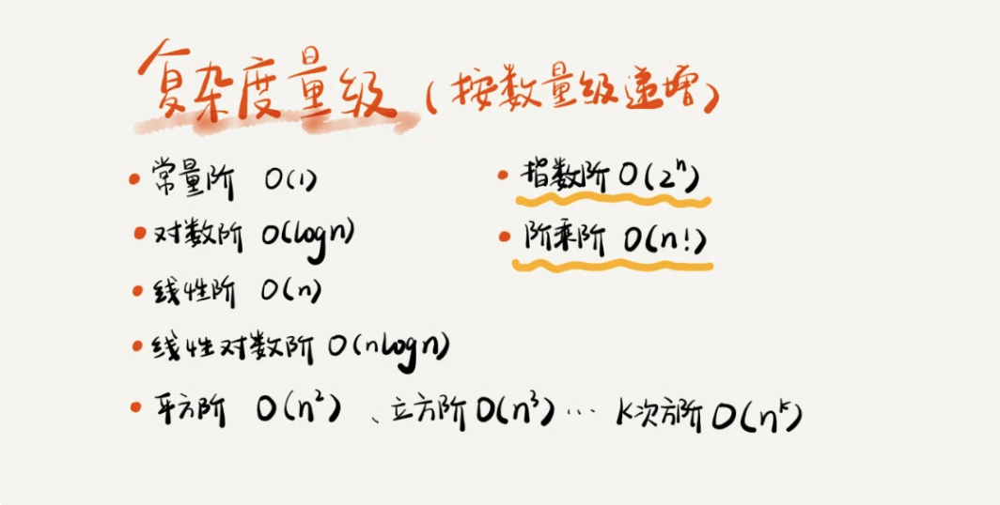
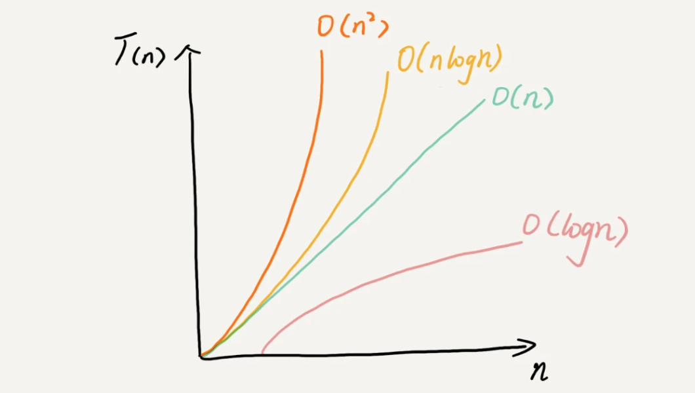

## 算法复杂度分析

 ### 为什么需要复杂度分析

- 测试结果非常依赖测试环境
- 测试结果受数据规模的影响很大

### 大O表示法

``` T(n) = O(f(n)) ```
大O时间复杂度实际上并不具体表示代码真正的执行时间，而是表示代码执行时间随数据规模增长的变化趋势。
所以，也叫作渐进时间复杂度（asymptotic time complexity），简称时间复杂度。

### 时间复杂度分析

1. 只关注循环执行次数最多的一段代码

`T(n) = 2 + 2*n`

所以时间复杂度为 n

```c
  int cal(int n) {
    int sum = 0;
    int i = 1;
    for (; i <= n; ++i) { // n次
      sum = sum + i;      // n次
    }
    return sum;
  }
```

2. 加法法则：总复杂度等于量级最大的那段代码的复杂度

`T(n) = 100 + n + n*n `

取其中最大的量级，所以，整段代码的时间复杂度为 n*n。

也就是说：总的时间复杂度就等于量级最大的那段代码的时间复杂度，抽象成公式为 <br/>
如果： T1(n) = O(f(n)) T2(n) = O(g(n)) <br/>
那么： T(n) = T1(n) + T2(n) = max(O(f(n)), O(g(n))) = O(max(f(n), g(n))) <br/>

```c
  int cal(int n) {
    // 常量的执行时间，与n的规模无关。
    int sum_1 = 0;
    int p = 1;
    for (; p < 100; ++p) {
      sum_1 = sum_1 + p;
    }

    // n
    int sum_2 = 0;
    int q = 1;
    for (; q < n; ++q) {
      sum_2 = sum_2 + q;
    }

    // n*n
    int sum_3 = 0;
    int i = 1;
    int j = 1;
    for (; i <= n; ++i) {
      j = 1;
      for (; j <= n; ++j) {
        sum_3 = sum_3 +  i * j;
      }
    }

    return sum_1 + sum_2 + sum_3;
  }
```

3. 乘法法则：嵌套代码的复杂度等于嵌套内外代码复杂度和乘积（嵌套循环）

如果： T1(n) = O(f(n)), T2(n) = O(g(n)) <br/>
那么： T(n) = T1(n) * T2(n) = O(f(n)) * O(g(n)) = O(f(n) * g(n))

```c
  // n * n
  int cal(int n) {
    int ret = 0; 
    int i = 1;
    for (; i < n; ++i) {
      ret = ret + f(i);
    } 
  } 
 
  // n
  int f(int n) {
    int sum = 0;
    int i = 1;
    for (; i < n; ++i) {
      sum = sum + i;
    } 

    return sum;
  }
```

### 常见的时间复杂度

```
O(1) < O(logn) < O(n) < O(nlogn) < O(n2 )
```

  <div align=center>
    
  </div>

  <div align=center>
    
  </div>

根据复杂度量级，可以分为：多项式和非多项式量级。其中，非多项式量级（也叫作NP，非确定多项目）只有两个：O(2^n) 和 O(n!)。

当n的规模越来越大时，非多项式量级算法的执行时间会急剧增加，求解问题的时间无限增长。


1. O(1)

常数级时间复杂度，指代码的执行时间跟n的大小无关，并不是指只执行了一行代码。

2. O(logn)、O(nlogn)

对数的时间复杂度的表示方法时，可以忽略对数的"底"，统一表示为 `O(logn)`

O(log2^n) = O(logn) （忽略"底"）
```c
  i=1;
  while (i <= n)  {
    i = i * 2;
  }
```

O(log3^n) = log3^2 * log2^n = log2^n （忽略常数复杂度） = O(logn)（忽略"底"）
```c
  i=1;
  while (i <= n)  {
    i = i * 3;
  }
```

3. O(m+n)、O(m*n)

```c
  // m + n
  int cal(int m, int n) {
    int sum_1 = 0;
    int i = 1;
    for (; i < m; ++i) {
      sum_1 = sum_1 + i;
    }

    int sum_2 = 0;
    int j = 1;
    for (; j < n; ++j) {
      sum_2 = sum_2 + j;
    }

    return sum_1 + sum_2;
  }
```


### 最好情况、最坏情况、平均情况、均摊情况时间复杂度

```c
  // n表示数组array的长度
  int find(int[] array, int n, int x) {
    int i = 0;
    int pos = -1;
    for (; i < n; ++i) {
      if (array[i] == x) {
         pos = i;
         break;
      }
    }
    return pos;
  }
```
- 最好情况：O(1) 第一个元素就是要查找的变量x
- 最坏情况：O(n) 最后一个元素或不存在要查找的变量x
- 平均时间：加权平均时间复杂度或者期望时间复杂度