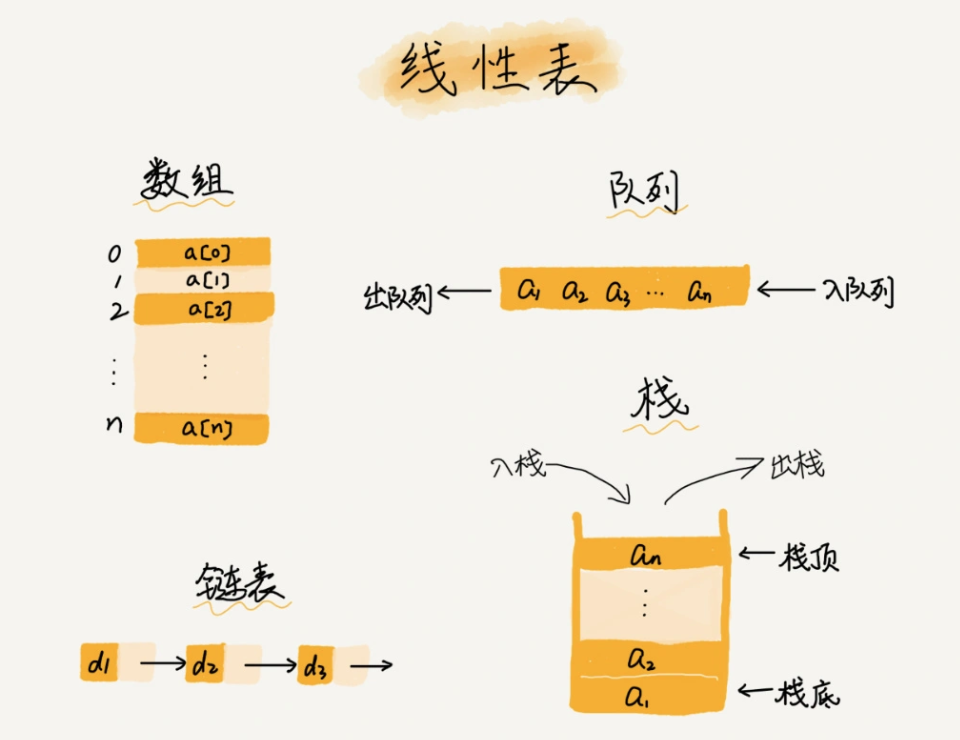

## 数组

### 什么是数组？
数组（Array）是一种`线性表`数据结构。它用一组`连续`的内存空间，来存储一组具有`相同类型`的数据。

1. 线性表

**线性表**：就是数据排成像一条线的结构。每个线性表上的数据最多只有前和后两个方向。其实除了数组，链表、队列、栈等也是线性表结构。

<div align=center>
  
</div>

**非线性表**：如二叉树、堆、图等。在非线性表中，数据之间并不是简单的前后关系。

<div align=center>
  
</div>


2. 连续内存空间和相同类型

**特性一**：随机访问

```
数组支持随机访问，根据下标随机访问的时间复杂度为 O(1)。但数组查询的时间复杂度并不为O(1)。
```

**特性二**：低效的"插入"和"删除"

因为保持内存的连续性，导致插入和删除操作需要移动数组元素，因而插入和删除操作低效。

插入小技巧：如果要将某个数据插入到第 k 个位置，为了避免大规模的数据搬移，我们还有一个简单的办法就是，直接将第 k 位的数据搬移到数组元素的最后，把新的元素直接放入第 k 个位置。

删除小技巧：使用类似标识清除算法，每次的删除操作并不是正正的搬移数据，只是记录数组已经被删除。当数组没有更多空间存储数组时，再触发一次真正的删除操作，这样就减少了删除操作导致的数据搬移。
