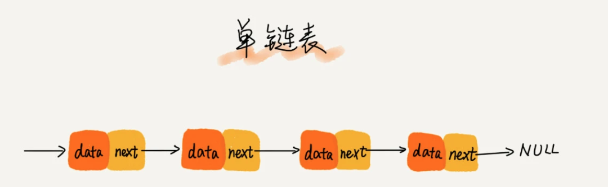
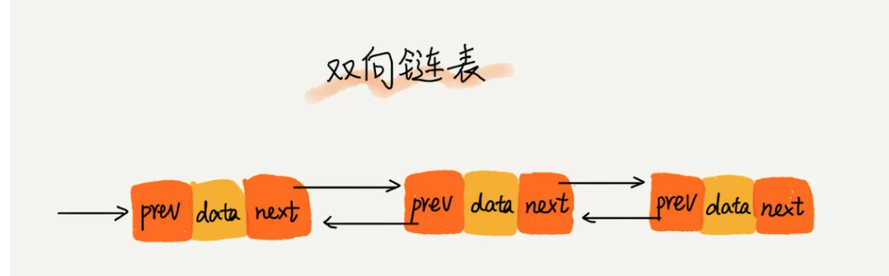
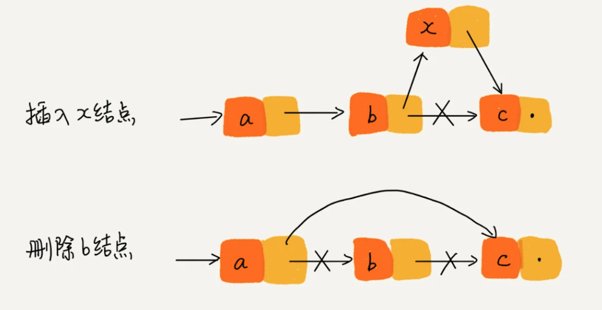

# 链表

**链表**（Linked List）是一种物理存储单元上`非连续`、`非顺序`的存储结构。区别于数组，链表中的元素不是存储在内存中连续的一片区域，
链表中的数据存储在每一个称之为「节点」复合区域里，在每一个节点除了存储数据以外，还保存了到下一个节点的指针（Pointer）。

  

由于不必按顺序存储，链表在插入数据的时候可以达到 O(1) 的复杂度（无需移动数据，只需要移动节点指针），
但是查找一个节点或者访问特定编号的节点则需要 O(n) 的时间（无法根据首地址和下标，通过寻址公式计算对应的内存地址，只能根据指针遍历）。

**循环链表** 跟单链表唯一的区别在于尾节点。单链表的尾节点指针指向空地址，而循环链表尾节点的指针指向链表的头节点。
其**优点**在于从链尾到链头比较方便。适合用于处理具有环型结构特点的数据。

**双向链表** 双向链表需要额外的两个空间来存储后继节点和前驱节点的地址。其**缺点**是占用更多的内存空间；**优点**是支持双向遍历，
支持O(1)时间复杂度查找前驱节点，使得双向链接在某些情况下插入、删除等操作都比单链表更简单、高效。

  

## 链表的常见操作

  

1. 链表删除操作

在实际的软件开发中，从链表中删除一个数据的两种情况：
- 删除节点中“值等于某个给定值”的节点
- 删除给定指针指向的节点

**第一种情况** 无论是单链表或双向链表，为了查找到值等于给定值的节点，都需要从头节点开始依次遍历，其查找的时间复杂度为O(n)，
查找到节点后删除操作的时间复杂度为O(1)。

**第二种情况** 因为已经给定要删除的节点指针，所以不存在第一种情况的查找*要删除的节点*；但`执行删除操作`时需要知道删除节点的前驱节点，
而`单链表不支持直接获取前驱节点`，所以，为了找到前驱节点，需要从头节点开始遍历链表查找前驱节点，时间复杂度为O(n)。
因为`双向链表的节点已经保存了前驱节点的指针`，不需要像单链表那样遍历。
所以，单链表删除操作需要O(n)的时间复杂度，而双向链接只需要O(1)的时间复杂度。

2. 链表插入操作

如果在指定节点之插入一个节点，单链表和双向链表效率相同。但如果在指定的节点之前插入一个节点，双向链表O(1)比单链表O(n)有很大优势。（单链表需要查找前驱节点）

3. 链表查询操作

对于一个有序链表，双向链表的查询效率比单链表高。因为，我们可以记录上次查找的位置 p，每次查询时，根据要查找的值与 p 的大小关系，
决定是往前还是往后查找，所以平均只需要查找一半的数据。

## 链表 VS 数组

数组和链表插入、删除、随机访问操作的时间复杂度。

| 时间复杂度 | 数组   | 链表   |
|:------|:-----|:-----|
| 插入/删除 | O(n) | O(1) |
| 随机访问  | O(1) | O(n) |

数组和链表的对比，并不局限于时间复杂度。在实际的软件开发中，不能仅利用时间复杂度分析就决定使用哪个数据结构。

数组简单易用，在实现上使用的是连续的内存空间，可以`借助 CPU 的缓存机制，预读数组中的数据`，所以访问效率更高。
而链表在内存中不是连续存储，所以对 CPU 缓存不友好，无法有效预读。

数组的缺点是大小固定，一经声明就要占用整块连续内存空间。声明过大，易引发"内存不足（out of memory）"，
如果声明过小，而在不够用时需要原数组拷贝。

## 如何基于链表实现 LRU 缓存淘汰算法？

我们维护一个有序单链表，越靠近链表尾部的结点是越早之前访问的。当有一个新的数据被访问时，我们从链表头开始顺序遍历链表。

1. 如果此数据之前已经被缓存在链表中了，我们遍历得到这个数据对应的结点，并将其从原来的位置删除，然后再插入到链表的头部。
2. 如果此数据没有在缓存链表中，又可以分为两种情况：
- 如果此时缓存未满，则将此结点直接插入到链表的头部；
- 如果此时缓存已满，则链表尾结点删除，将新的数据结点插入链表的头部。

因为不管缓存有没有满，我们都需要遍历一遍链表，所以这种基于链表的实现思路，缓存访问的时间复杂度为 O(n)。

优化实现思路：比如引入散列表（Hash table）来记录每个数据的位置，将缓存访问的时间复杂度降到 O(1)

## 练习题
- 单链表反转
- 链表中环的检测
- 两个有序的链表合并
- 删除链表倒数第 n 个结点
- 求链表的中间结点