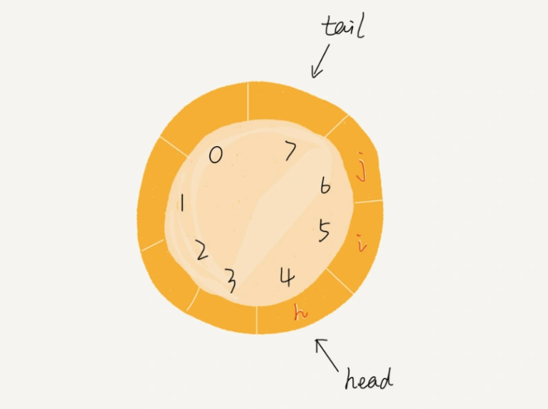

# 队列

队列（Queue）是一种`操作受限`的线性表。队列只允许在后端（rear）进行插入（enqueue）操作，在前端（front）进行删除（dequeue）操作。具有`先进先出`的特征。

队列通常使用链表或数组来实现。

## 顺序队列和链式队列

用数组实现的队列叫作`顺序队列`， 用链表实现的队列叫作`链式队列`。

## 常见队列

**普通队列**：固定长度的普通队列，在不队列的入队、出队操作，尾指针将不断往后端（rear）移动， 当tail移动到队尾时，即使队列中还有剩余空间，
也无法继续往队列中添加数据了（`假溢出`）。 解决的方法有两种：1. 将队列中的所有元素向低地址区移动（一般是在入队列时检测到假溢出时移动） 2. 使用循环队列

**循环队列**：队列的首尾相连接，形成一个环。循环队列可以解决普通队列的假溢出问题。

  

**阻塞队列**：阻塞队列是在普通队列的基础上增加了阻塞操作。简单来说，就是在队列为空的时候，从队头取数据会被阻塞。因为此时还没有数据可取，
直到队列中有了数据才能返回；如果队列已经满了，那么插入数据的操作就会被阻塞，直到队列中有空闲位置后再插入数据，然后再返回。（生产者消费者模型）

**并发队列**：指线程安全的队列。

